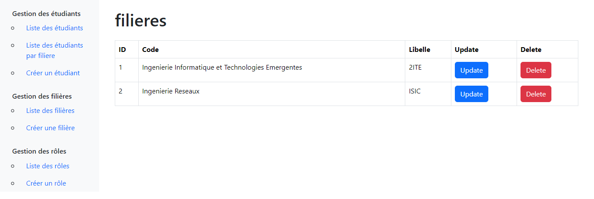
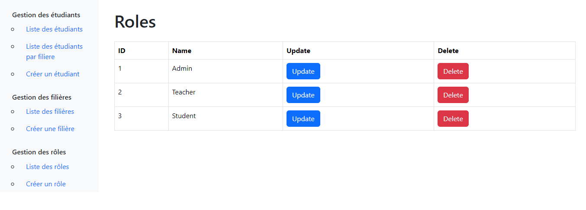
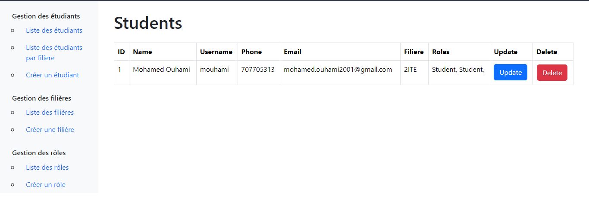
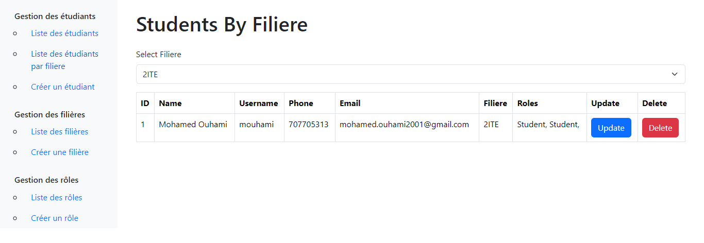
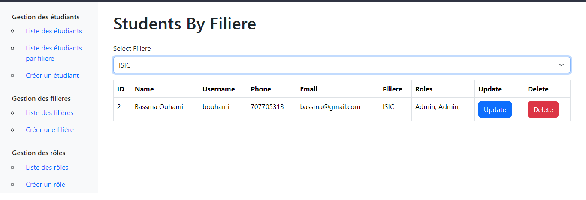
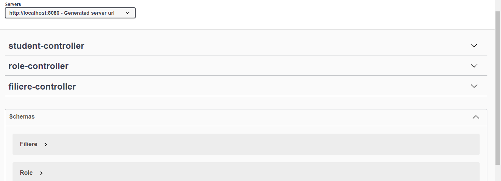

# Gestion des Étudiants

Bienvenue dans l'application web "Gestion des Étudiants", un outil puissant pour gérer les étudiants, les filières, les rôles, assigner des rôles aux étudiants et des filières aux étudiants.

## Table des matières

1. [Introduction](#introduction)
2. [Configuration Requise](#configuration-requise)
3. [Installation](#installation)
4. [Utilisation](#utilisation)
5. [Fonctionnalités Principales](#fonctionnalités-principales)
6. [Contributions](#contributions)
7. [Licence](#licence)

## Introduction

L'application "Gestion des Étudiants" est un outil conçu pour faciliter la gestion des étudiants dans un établissement. Que vous soyez un administrateur, un enseignant ou un membre du personnel, cette application vous offre la possibilité d'ajouter, de modifier et de gérer les informations des étudiants, des filières, des rôles, ainsi que l'attribution de rôles et filières aux étudiants.

## Configuration Requise

Avant de commencer, assurez-vous que votre environnement de développement répond aux exigences suivantes :

- Java Development Kit (JDK) 8 ou version supérieure
- Apache Maven (pour la gestion des dépendances)
- Système de gestion de base de données (par exemple, MySQL, PostgreSQL)
- Serveur d'application Spring Boot (intégré ou autonome)

## Installation

Pour installer l'application "Gestion des Étudiants", suivez ces étapes :

1. Clonez ce référentiel sur votre système.

git clone [https://github.com/MohamedOuhami/GestionEtudiantFiliere]

2. Accédez au répertoire de l'application.

cd backend

3. Configurez la base de données en modifiant le fichier `application.properties` avec les détails de votre base de données.

4. Exécutez l'application à l'aide de Maven.
mvn spring-boot:run

5. Accedez au React pour le front-end
cd ../frontend
npm install
npm start

L'application sera accessible à l'adresse [http://localhost:8080](http://localhost:8080).

## Utilisation

L'application "Gestion des Étudiants" offre une interface conviviale pour ajouter, éditer et gérer les étudiants, les filières, les rôles et les attributions de rôles et filières aux étudiants. Voici quelques-unes des fonctionnalités principales :

### Gestion des Étudiants

- Ajoutez de nouveaux étudiants en spécifiant leurs informations personnelles.
- Consultez et modifiez les informations des étudiants existants.
- Supprimez des étudiants du système si nécessaire.

### Gestion des Filières

- Créez de nouvelles filières en indiquant leur nom, code, etc.
- Consultez et mettez à jour les informations des filières existantes.
- Supprimez des filières si elles ne sont plus nécessaires.

### Gestion des Rôles

- Définissez des rôles tels que "Étudiant", "Enseignant", "Administrateur", etc.
- Associez des rôles aux étudiants pour déterminer leurs autorisations.
- Modifiez ou supprimez des rôles selon vos besoins.

### Attribution de Rôles et Filières aux Étudiants

- Associez des rôles aux étudiants pour définir leurs responsabilités.
- Attribuez des filières aux étudiants pour suivre leur progression académique.

## Fonctionnalités Principales

- Interface utilisateur conviviale.
- Gestion complète des étudiants, des filières, des rôles et des attributions.
- Fonctionnalités d'ajout, de modification et de suppression faciles à utiliser.
- Sécurité renforcée pour protéger les données sensibles.

# Partie Mobile : 
La partie mobile est annule a cause des problemes techniques ( Surcharge sur PC )"# GestionSchool" 
